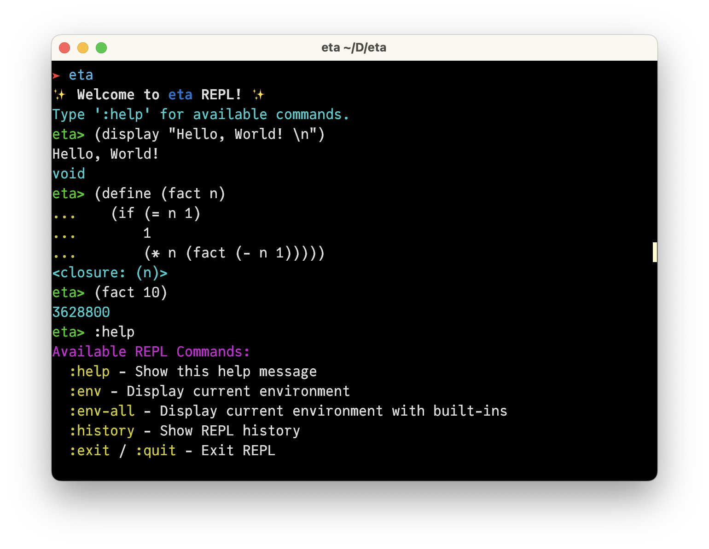

# eta

[](https://deepwiki.com/abap34/eta)

**eta** is a toy Scheme interpreter written in Scheme. 

<div align="center">
  

[Examples](/examples)

[Devdocs](/devdocs)

[Presentation (Japanese)](https://abap34.github.io/eta-presentation/)
</div>


---

## 📦 Project Structure

```
eta/
├── eta/           ; Main source code
├── tests/         ; Unit tests
├── examples/      ; Example programs
├── devdocs/       ; Developer documentation
├── tools/         ; Utility scripts
├── Makefile       ; Build and test 
└── main.rkt       ; Main entry point
```

---

## 🚀 Getting Started

### Requirements

Scheme implementation that supports R6RS.

I built and tested with: [Rackets](https://docs.racket-lang.org/).

### Installation

```
$ make install 
$ make install PREFIX=/usr/local SCHEME=racket BINDIR=/usr/local/bin  # optional. see Makefile for more options
```

### Enter the REPL

```
$ eta
```

### Run a file

```
$ eta --script <filename>
```

In the REPL, you can use following commands:

| Command           | Description                                        |
| ----------------- | -------------------------------------------------- |
| `:help`           | Show help                                          |
| `:env`            | Show environment variables                         |
| `:env-all`        | Show all environment variables including built-ins |
| `:history`        | Show REPL history                                  |
| `:exit` / `:quit` | Exit the REPL                                      |


### Run tests

```
$ make test
```

### Features

- **REPL**: Interactive Read-Eval-Print Loop for immediate feedback.
- **First-class Continuations**: Supports advanced control flow.
- **Tail Call Optimization**: Efficient recursion handling.

## License

This project is licensed under the MIT License. See the [LICENSE](LICENSE) file for details.

